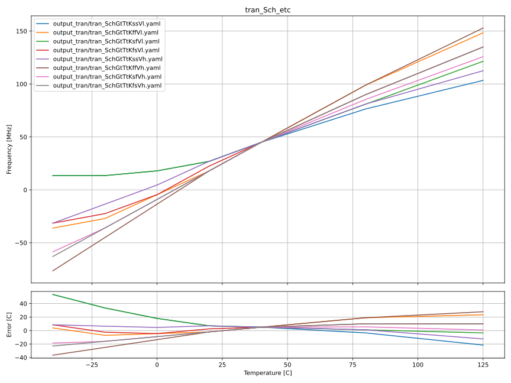

# CNR_TS1_SKY130NM

# Who
Carsten Wulff

# Why
Very quick and dirty temperature sensor 

# How
See [documents/schematic.md](documents/schematic.md) for details.

# What

| What            | Lib/Folder       | Cell/Name |
| :-              | :-:              | :-:       |
| Schematic       | CNR_TS1_SKY130NM | CNR_TS1 |
| Layout          | CNR_TS1_SKY130NM | CNR_TS1 |
| LPE             | CNR_TS1_SKY130NM | CNR_TS1 |

# Changelog/Plan
| Version | Status | Comment|
| :-| :-| :-|
|0.1.0 | :white_check_mark: | Inital attempt |

# Signal interface
| Signal    | Direction | Domain  | Description                                       |
|:----------|:---------:|:-------:|:--------------------------------------------------|
| VDD_1V8   | Input     | VDD_1V8 | Main supply                                       |
| VSS       | Input     | Ground  |                                                   |
| PWRUP_1V8 | Input     | VDD_1V8 | Power up the circuit                              |
| DO_1V8    | Output    | VDD_1V8 | Frequency inversly proportionalish to temperature |

# Key parameters
| Parameter   | Min | Typ             | Max | Unit |
|:------------|:---:|:---------------:|:---:|:----:|
| Technology  |     | Skywater 130 nm |     |      |
| AVDD        | 1.7 | 1.8             | 1.9 | V    |
| IDD         |     | 90              |     | uA   |
| Temperature | -40 | 27              | 125 | C    |

# Status

| Stage                       | TYPE | Status             | Comment |
|:----------------------------|:----:|:------------------:|:-------:|
| Specification               | DOC  | :white_check_mark: |         |
| Schematic                   | VIEW | :white_check_mark: |         |
| Schematic simulation        | VER  | :white_check_mark: |         |
| Layout                      | VIEW | :x:                |         |
| Layout parasitic extraction | VIEW | :x:                |         |
| LPE simulation              | VER  | :x:                |         |
| LVS                         | VER  | :x:                |         |
| DRC                         | VER  | :x:                |         |
| ERC                         | VER  | :x:                |         |
| ANT                         | VER  | :x:                |         |

# Simulations

See [sim/CNR_TS1/README.md](sim/CNR_TS1/README.md) for details.

In typical corner, the temperature behavior is decent. 

Over extreme corners, however, the temperature behavior is not the best.

