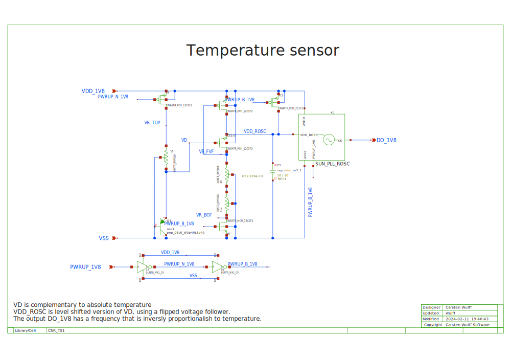
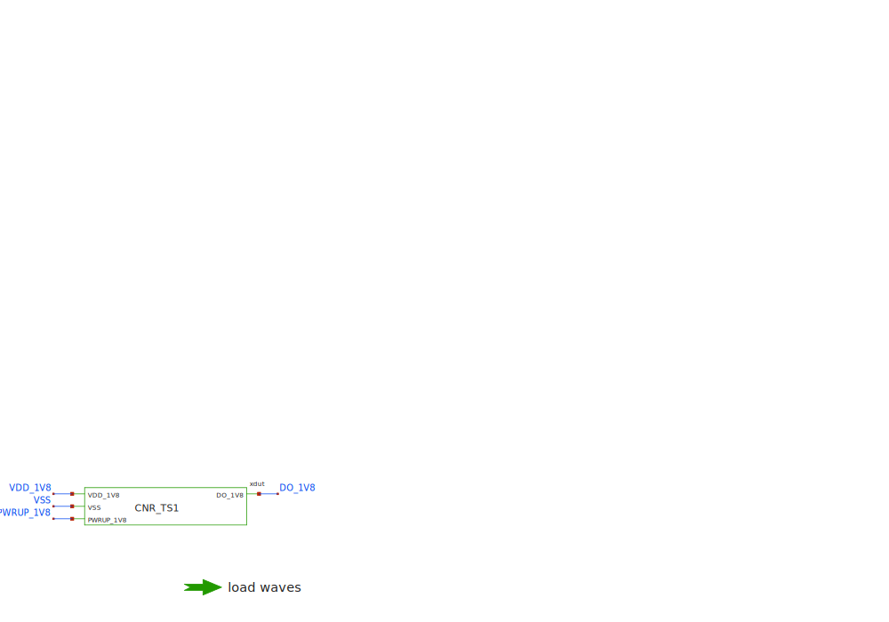

## CNR_TS1_SKY130NM/CNR_TS1.svg

The VD voltage is inversly proportional to temperature. 

A flipped voltage follower is used to buffer the VD voltage, and serve as the
supply to a ring oscillator. 

The ring oscillator is from
[SUN\_PLL\_SKY130NM](https://github.com/wulffern/sun_pll_sky130nm) and includes
a level shifter. 

## CNR_TS1_SKY130NM/CNR_TS1_TB.svg

